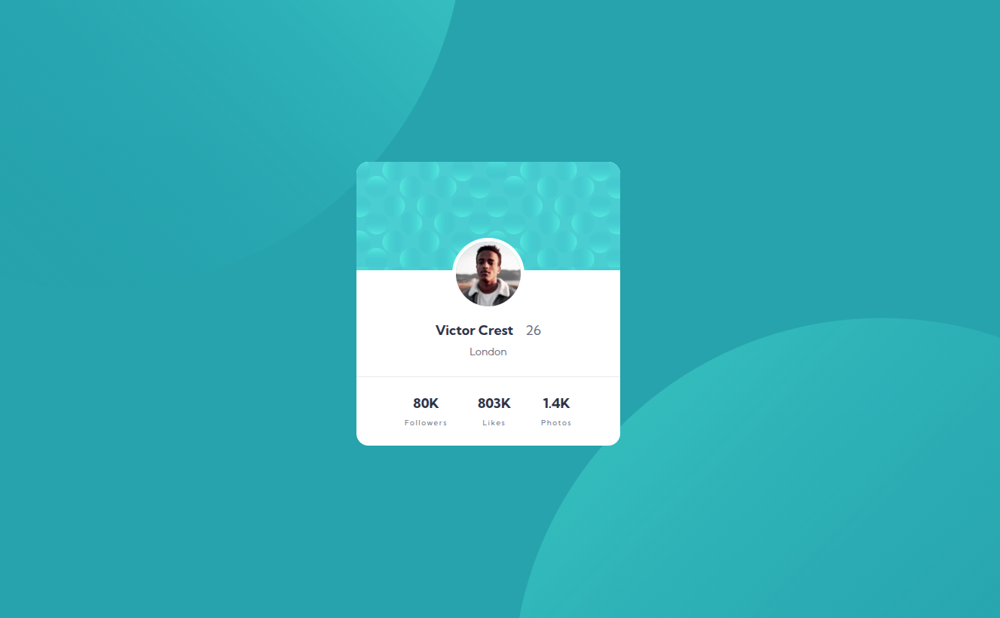
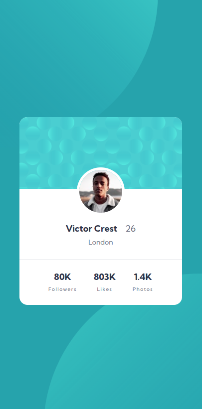

# Profile Card Component

A Profile card component with decorations in the background! Feel free to give me a star 😄
 
 
It features a responsive profile card component.
 
 
I was able to use custom font with **google fonts**, **variables**, **media-queries** and **flex-box**

---

## 📸 Preview

### Desktop

### Mobile

## 

## How to use and customize

1. Clone the repo

`git clone https://github.com/rodrigodvalente/profile-card-component.git`

2. Navigate to the directory

`cd profile-card-component`

3. Open the `index.html` and customize in your code editor of preference

---

## 🧠 Best practices

It features **variables**, **BEM**, **media-queries**

I also used Prettier to make the layout better on **VSCode** and used the command line for versioning with Git.

